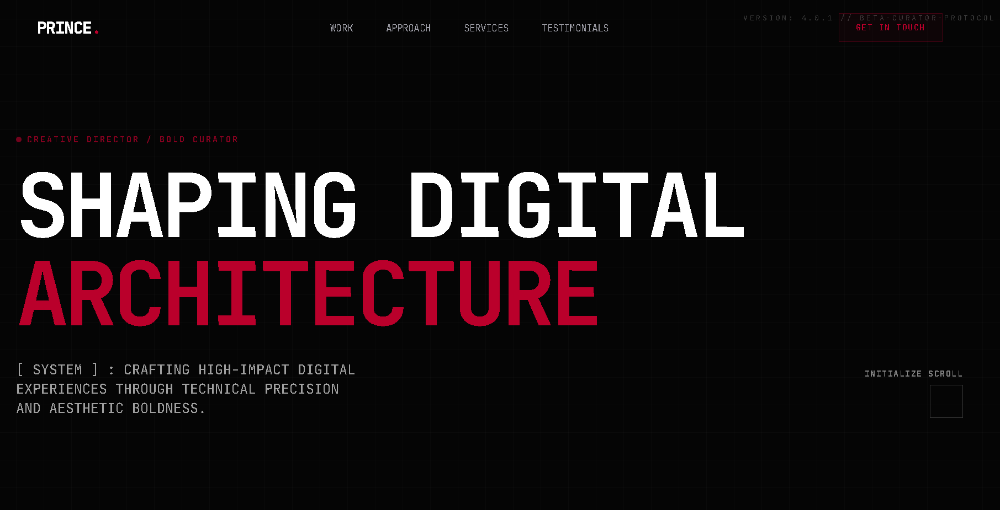

# Architecture of Boldness // Digital Portfolio

A highly technical, avant-garde digital portfolio built for the modern web. Inspired by retro-digital aesthetics, raw technical data readouts, and top-tier Awwwards web experiences.

## Project Preview


## Tech Stack
- **Framework**: Nuxt 4 (Vue 3, SSR/SSG capabilities)
- **Styling**: UnoCSS (Atomic CSS engine), raw unopinionated CSS for components
- **Animations**: GSAP (ScrollTrigger, TextPlugin) & Lenis (Smooth Scrolling)
- **Visuals**: Raw WebGL (Custom Fragment Shaders) & HTML5 Canvas

## Setup & Deployment

1. **Install dependencies:**
   ```bash
   npm install
   ```

2. **Start the development server:**
   ```bash
   npm run dev
   ```
   > Server will be live at `http://localhost:3000`

3. **Build for production:**
   ```bash
   npm run build
   ```
